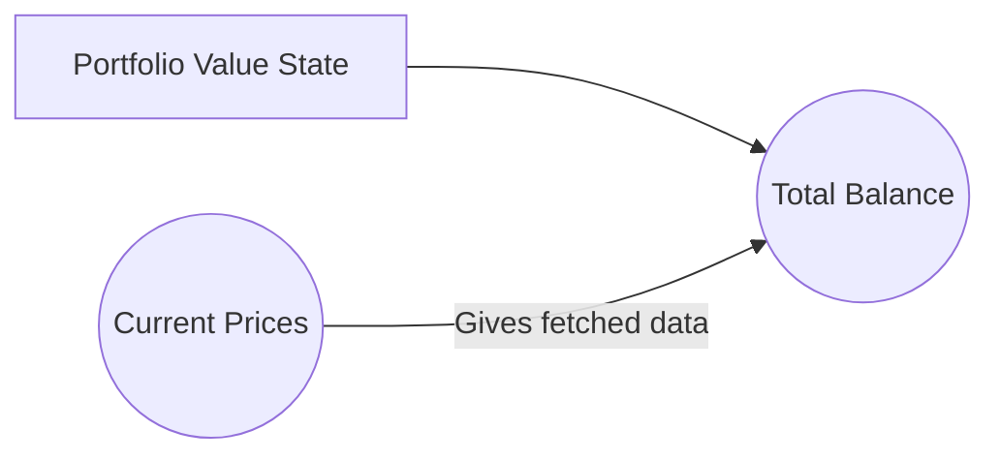

# Portfolio Display
## Live Preview (Expo)
https://expo.dev/@sionkim00/portfolio-display
## Goal
 - [x] Make a portfolio with 3 currencies
 - [x] Render graph that provides overview of portfolio
 - [x] Have custom day filters for the chart

## Stacks

 - React Native
 - [React Recoil](https://recoiljs.org/)
 - React Navigation
 - [Wagmi Chart](https://github.com/coinjar/react-native-wagmi-charts)
 - [Switch Selector](https://github.com/jkdrangel/react-native-switch-selector)
 ## 🖥  Developments
 Main features of application: 
 - Provides oversight of the currencies
 - User can customize their portfolio
 - Keep track of the portfolio

My initial thought was to have Context API to manage global states to track portfolio values. But it would require an outside helper function to manage data (since this is a data-heavy application), which can result in complexity and low code readability. So in this application, I use Recoil to manage global states (portfolio values). Each atom from Recoil is a unit of state and it is updatable & subscribable.

Since we have Recoil, there is no need to worry about sequential data changes (such as total portfolio value). For derived data that is based on state values, [Selector](https://recoiljs.org/docs/basic-tutorial/selectors)  will re-evaluate each time the state changes. 

*Atom: Portfolio Value*
*Selector: getCurrentPrices, getTotalBalance*

In order to draw a historical chart, I had to merge balances from different currencies. Since selectors are subscribable, I created a selector that fetches data from the API, and then created other selectors that subscribes to it in order to derive/filter data. 
In *getHourlyTotalBalance*, Steps can be demonstrated as:

 1. Fetch data from API. Since I need prices at hourly & daily timeframe , I created *getMarketDatas* selector that returns price hourly (length: 24) and daily (length: 365) price object.
 2. Subscribe to portfolio value state
 3. Merge portfolio value and prices return an array that contains timeframe and hourly balance.

_getDailyTotalBalance_ is done in a similar manner and sliced as needed.

 ## Further Improvements

1. There is a performance issue when yearly graph is rendered. It's caused because it has 365 different points. This can be fixed with smaller length (possibly weekly; 48 points).
2. Suspense currently display empty screen

## 👀 Service Display

|  |  |
|--|--|
| Home Screen | Add Coin |

|  |  
|--|
| Analytics Screen |
